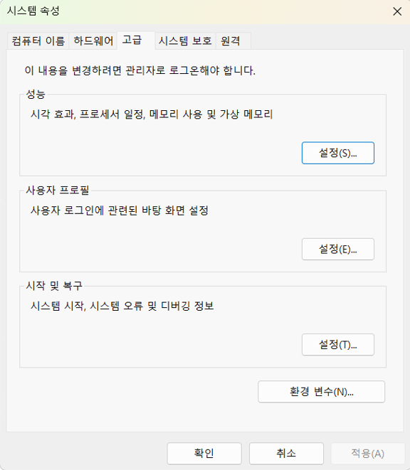
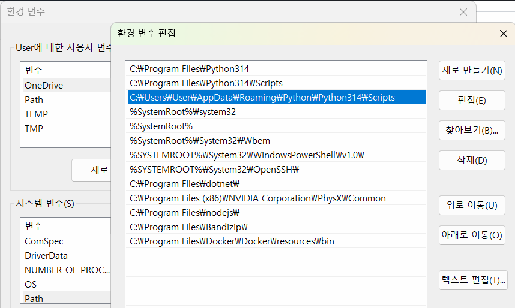

### 개요

- tFastAPI - Python으로 API서버를 만드는 웹 프레임워크
- API - Application programing interface
- 사용자 (클라이언트)가 웹, 모바일, 앱에서 요청을 하면 FastAPI 서버가 요청을 처리, 결과를 돌려줌
- JSON 타입(파이썬 딕셔너리와 유사)으로 결과 리턴
- 예
  ```plaintext
  사용자 (클라이언트)
  -> GET/ students 요청
  -> FastAPI 서버에서 DB를 조회
  -> 학생목록 결과 JSON 응답
  ```
- 클라이언트 (요청 Request) -> 서버 (응답 Response)

### FastAPI 특징

- Python 문법으로 API를 만들 수 있음
- 코드가 간결하다
- 실행 속도가 빠르다
- 테스트를 위한 UI를 자동으로 만들어 줌
- Pydantic을 사용, 요청과 응답 데이터를 검증할 수 있다
- PostgreSQL, MySQL, Oracle등 DB와 연동이 쉽다

### API 서버

클라이언트 요청을 받아 필요한 작업을 수행, 그 결과를 클라이언트에게 돌려주는 시스템

### 개발환경 설정

### FastAPI 패키지 설정

```bash
pip install fastapi uvicorn 
```

현재 파이썬에 fastapi와 uvicorn 패키지를 설치
fastapi 개발 가능

```bash
pip list
```

- 패키지 설치 확인

### 기초 FastAPI 서버

- 소스작성
- VS CODE 재시작

### 문제해결

- 설치한 uvicorn.exe 위치가 python 설치 위치와 상이
- C:\Users\User\AppData\Roaming\Python\Python314\Scripts 경로가 시스템 경로에 등록 되어야 함
- 시스템 속성(sysdm.cpl)실행





- 시스템 변수내 Path 상세에서 파이썬 경로 추가
- 확인
- vs Code 터미널 재시작

### FastAPI서버 시작

```bash
uvicorn main:app --reaload --port 8000
```

`--reload`: 수정되면 곧바로 반영되어서 서버 재시작
`--port 8000`: 서버를 시작할 포트 지정
http://127.0.0.1:8000 메세지ㅣ 확인

- 127.0.0.1 -> local host\

### Fast API 기본 학습

웹 응답코드

- 200: OK 웹페이지에 문제없음
- 404 : Page not found 클라이언트가 요청한 페이지나 데이터가 없음
- 500: internal Server Error 내부서버 오류

### Swagger UI 확인

- FastAPI에서 자동으로 제공되는 API테스트 페이지

********************************************
- API의 결과는 json 타입 (문자열 일반적으로 "로 표현). 파이썬 '딕셔너리로 표현하는 것과 차이점

### URL경로

- http(s)://address:port
- address -127.0.0.1 또는 192.168.0.105 등 아이피 주소,www.naver.com, google.com 등의 도메인 주소
- port - 0 ~ 65353 까지의 숫자
- /-root 기본되는 페이지
- /students - 추가 URT. Restful
- /students - 추가 URT. 경로파라미터
- /?key=value -URL 경로 GET 쿼리 파라미터

### HTTP(S) 메서드

FastAPI는 주소와 HTTP 메소드도 파악필요

-GET메서드 외에는 Sweager 메서드에서 테스트 해야함 post, put , patch, delete


### 요청본문

- post나 patch 요청시는 클라이언트가 json으로 데이터를 서버에 전달해야 함. 그 데이터를 등록 또는 수정
- FastAPI에서는 Pydantic 패키지 모델을 사용
- JSON데이터이므로 파이썬 None 대신 null로 사용
- } 닫기 전, 는 제거 {파이썬은 허용}

#### 메모리 기반(DB x) 학생 예제

- DAY05/memorydb_py
  -get method 함수 내용 생략

### POST학생 정보 생성

- POST 메서드 작성

### request body


### HTTP Exception
- API상에 오류가 발생하면 오류 (예외)처리를 진행

상태코드 / 의미
200,201 / 요청 성공, 생성성공
403,404 / 권한 없음, 데이터 없음
500     / 서버 오류


### DB연동 FastAPI (DAY-06)

- 더 간단한 구조- 우선적으로 구현할 구조 

fastapi_postgres/
│

├── main.py          # FastAPI 웹 서버

└── database.py      # PostgreSQL 연결

#### DB연동 파이썬 패키지 설치

- psycopg 

pip install psycopg[binary]

- 내 개발환경 (파이썬 패키지)공유

pip freeze > requirements.txt    requirements.txt 파일만 전달

- 개발환경 재설치

pip install -r requirements.txt

#### 기존 PostgreSQL students 테이블 사용
- 내용 생략


### database.py
- PostgresSQL데이터 베이스 연결용 소스코드
- 소스


### main.py
- database.py를 db 연동결과 

### 디버깅

- Debug - 버그를 고치는 작업
- 소스코드 작성에 60% 디버그 40% 시간소요
- 디버그 단축키
- F5: 디버그 실행
- F9: 브레이크 포인트 토글
- F10: 한 단계씩 실행(함수 패스)
- F11: 한 단계씩 실행(함수내 진입)


### FastAPI 디버깅
 - 기존 FastAPI 소스코드 외 아래의 디버그 코드 추가

 python
 import uvicorn

 # 기존코드 생략
 
if_name_=='__main__':
uviconrn.run(
  'main.app',
  hots= '127.0.0.1',
  port= 8000
  reload=True,
  log_level='debug'
)

- F5(디버그 모드)로 실행
- 디버깅 필요한 함수나 로직에 F9로 종단점 (BREAK POINT)활성화
- 로직 실행하면 종단점에 일시 중단
- F18 또는 F11로 한줄씩 실행하면서 로직 처리 결과 모니터링, 조사식과 변수에서 데이터 확인
- 오류 로직 찾아서 수정
- 다시 디버깅으로 정상동작 확인하고 완료